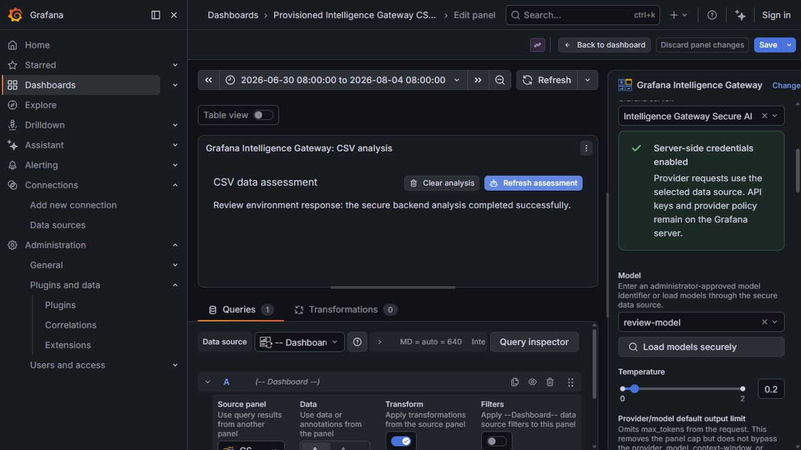

# Grafana Intelligence Gateway

[](https://github.com/DigitalRCS/grafana-intelligence-gateway/actions/workflows/ci.yml)
[](LICENSE)

Grafana Intelligence Gateway is a panel plugin by **DigitalRCS** that turns Grafana DataFrames into focused AI assessments. All provider traffic is routed through the required DigitalRCS secure AI data source, which supports OpenAI, LM Studio, and custom OpenAI-compatible chat-completions APIs.

Plugin ID: `digitalrcs-intelligencegateway-panel`  
Grafana: `>=11.6.0` (the multi-version GitHub Actions E2E matrix is the compatibility authority)



For the complete setup guide, every panel option, example values, provider-specific instructions, and troubleshooting, use the [GitHub Wiki](https://github.com/digitalrcs/grafana-intelligence-gateway/wiki).

## Features

- Reads time-series and table query results from `PanelProps.data.series`.
- Serializes field names, types, labels, units, recent rows, and the active time range.
- Supports `{{data}}`, `{{timeRange}}`, `{{panelTitle}}`, `{{panelId}}`, `{{skills}}`, and `{{sourcePanel}}` prompt variables plus Grafana dashboard variables.
- Provides system instructions, a user template, reusable skills/context, and a live constructed-prompt preview.
- Offers manual analysis, a clear-analysis control, optional debounced auto-analysis, context-size controls, cancellation, and bounded buffered responses.
- Provides a hard output-token slider up to 1,048,576, a provider-default/no-panel-cap mode, and a separate soft visible-answer length instruction.
- Renders sanitized Markdown through Grafana UI with theme-aware colors, loading state, actionable errors, and configurable typography/layout.

## Secure architecture

The companion [`digitalrcs-intelligencegateway-datasource`](https://github.com/DigitalRCS/grafana-intelligence-gateway-datasource) is a declared plugin dependency. Configure its provider credential in Grafana `secureJsonData`, then select the instance under **AI provider > Secure AI data source**. The panel stores only the data-source UID and non-secret generation choices. Prompts go through Grafana's authenticated resource API; decrypted credentials never reach dashboard JSON or browser code.

HTTPS is required by default. Data-source administrators can explicitly enable **Allow insecure HTTP** when an organizational provider endpoint cannot be classified reliably by hostname or IP range. The override permits HTTP regardless of address classification, so credentials and prompts may be exposed in transit.

The panel has no API-key, bearer-token, provider-URL, or direct browser transport options. Provider selection, endpoint policy, credentials, and transport security are owned by the companion data source.

See [Secure Backend and Secret Storage](https://github.com/digitalrcs/grafana-intelligence-gateway/wiki/Secure-Backend-and-Secrets) for the panel workflow and the [data-source wiki](https://github.com/digitalrcs/grafana-intelligence-gateway-datasource/wiki) for installation, provisioning, reviewer setup, and enforced backend policies.

## Install for development

Requirements: Node.js 22+, npm, Docker, and Docker Compose. The official scaffold CLI supports Linux/macOS; on Windows use WSL for scaffolding.

```bash
npm install
npm run dev
docker compose up
```

Open <http://localhost:3004>. The integrated Docker environment mounts both sibling plugins, starts a credential-free deterministic mock provider, and provisions an `Intelligence Gateway Secure AI` data source. Build the companion frontend and Linux backend first. Anonymous Admin access is enabled only in this local development container.

The provisioned test dashboard uses [`testdata/datasource.csv`](testdata/datasource.csv). After replacing that file, run `npm run sync:test-data` and restart Grafana. The command embeds the CSV in Grafana TestData's **CSV Content** query and adjusts the dashboard time range to the file's timestamps.

Production build:

```bash
npm run typecheck
npm run lint
npm run test:ci
npm run build
```

## Connect data from another panel

The reliable public-API route is Grafana's built-in **Dashboard** data source:

1. Add Grafana Intelligence Gateway to the dashboard.
2. In its query editor, select the `-- Dashboard --` data source.
3. Select the source panel whose query results should be reused.
4. Apply Grafana transformations if you need to reduce or reshape the input.
5. Set **Recent rows per frame** and **Maximum context characters** to control payload size.
6. Select **Analyze**.

The **Source panel title or ID (hint)** option adds a label to the prompt; it does not fetch another panel. Grafana does not expose another panel's live query result through a stable public runtime API. Depending on private dashboard-model internals would reduce compatibility and catalog readiness.

For screenshots-independent, step-by-step instructions, transformation choices, dashboard JSON, multiple-frame behavior, and troubleshooting, see [Connecting data from another Grafana panel](docs/CONNECTING_DATA.md).

The illustrated setup walkthrough is in [Panel Setup and Configuration](https://github.com/digitalrcs/grafana-intelligence-gateway/wiki/Panel-Setup-and-Configuration).

## Provider configuration

### Secure AI data source (required)

- Install and configure the companion data source.
- Select it under **Secure AI data source**.
- Select or enter an administrator-allowed model.
- Configure temperature and the panel request cap. The backend applies the lower of the panel cap and administrator ceiling.
- The panel request is buffered and cancellable. The backend enforces its own timeout, body, model, and token policies.

Configure OpenAI, LM Studio, or a custom OpenAI-compatible endpoint in the companion data source. For LM Studio running outside the Grafana container, use a server-reachable host such as `host.docker.internal`, not browser `localhost`. The data-source Wiki documents HTTPS and the explicit development-only insecure HTTP override.

## Prompt design

The default template keeps instructions and data separate. Put stable role/risk rules in **System / backend prompt**, the task and variables in **User message template**, and domain definitions/runbooks in **Skills / additional context**.

Treat dashboard data and labels as untrusted content. Tell the model not to follow instructions embedded in data. Keep row and character caps conservative, especially when logs contain arbitrary user text.

## Signing and packaging

The generated CI builds, tests, signs when `GRAFANA_ACCESS_POLICY_TOKEN` is present, packages the plugin directory as a ZIP, and runs the metadata validator. The release workflow uses `grafana/plugin-actions/build-plugin` on `v*` tags.

For private signing with allowed roots:

```bash
export GRAFANA_ACCESS_POLICY_TOKEN="..."
npm run build
npm run sign -- --rootUrls https://grafana.example.com/
```

For community catalog signing, ensure the `digitalrcs` prefix matches the Grafana Cloud organization slug, configure the `GRAFANA_ACCESS_POLICY_TOKEN` GitHub secret after Grafana grants a public signature level, create a GitHub release from the exact source tag, and submit the artifact through Grafana's plugin submission process. Restart Grafana after any `plugin.json` change.

See [Grafana Compatibility and Certification](docs/CERTIFICATION.md) for the current readiness checklist and the exact submission fields.

## Repository map

- `src/components/IntelligenceGatewayPanel.tsx` — runtime UI and analysis lifecycle.
- `src/utils/aiClient.ts` — secure data-source resource transport and response/error normalization.
- `src/utils/dataFrames.ts` — bounded, label-aware DataFrame serialization.
- `src/utils/prompt.ts` — prompt-template construction.
- `src/module.ts` — panel option registration.
- `provisioning/dashboards/dashboard.json` — local development dashboard.
- `examples/dashboard.json` — importable configuration example.
- `wiki/` — source for the published GitHub Wiki pages.

## Roadmap

- OpenAI Responses API and richer secure streaming support.
- Server-side audit controls and per-user/provider quotas.
- Provider-specific adapters for OpenAI Responses API and Copilot conversations.
- Multi-panel context selection using supported Grafana APIs as they become available.
- Response persistence, citations back to fields/timestamps, and richer streaming controls.

See [CONTRIBUTING.md](CONTRIBUTING.md), [SECURITY.md](SECURITY.md), and the [wiki](wiki/Home.md).
