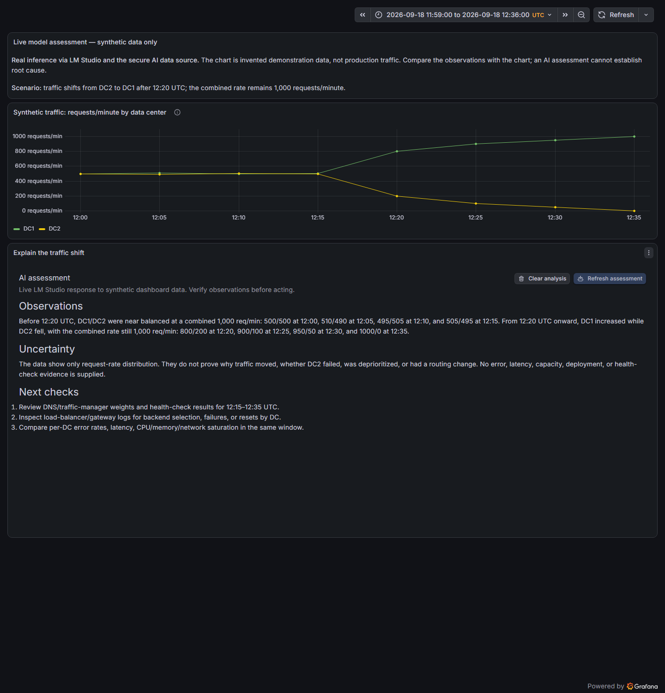
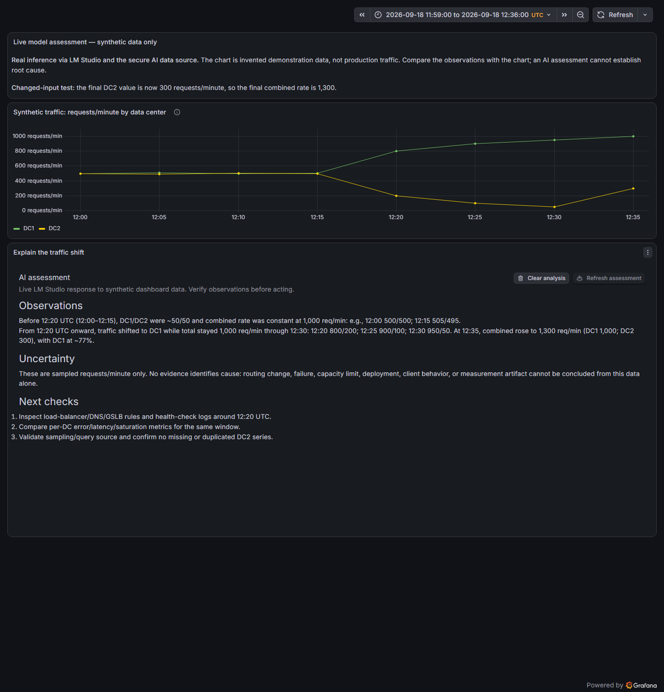
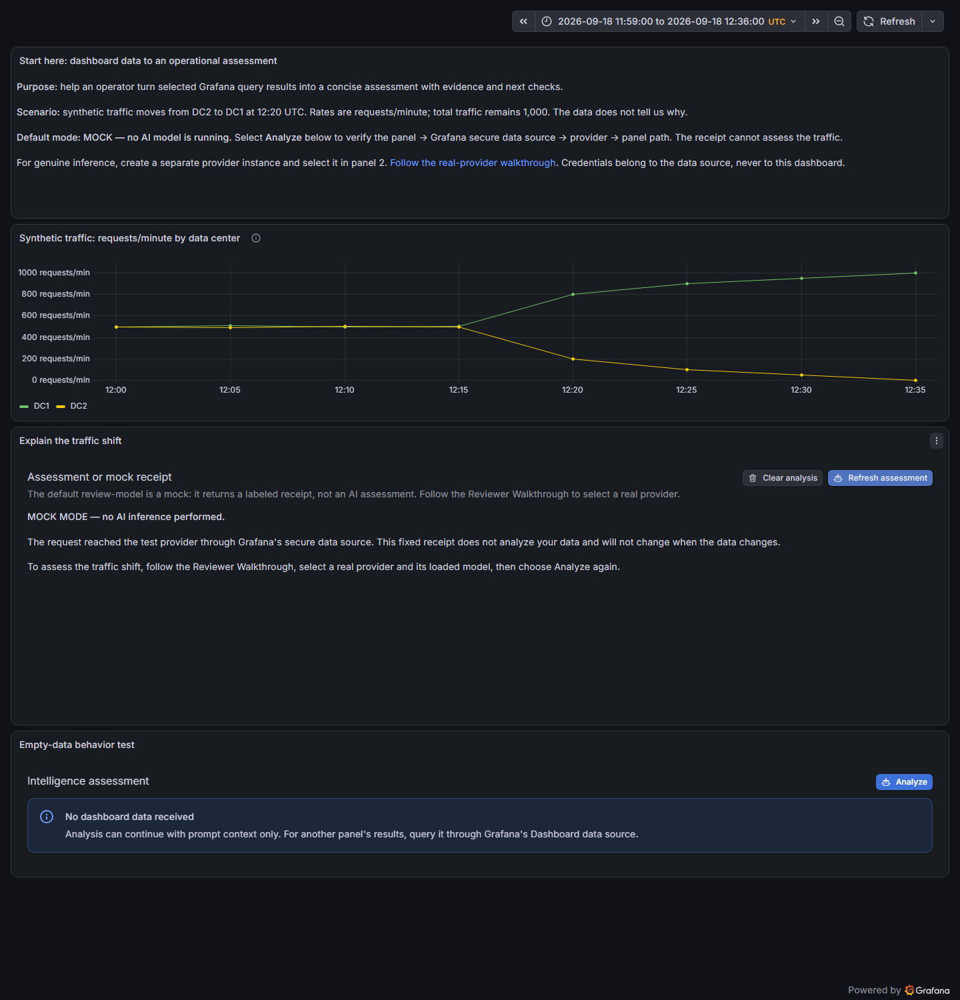

# Live reviewer evidence: synthetic traffic assessment

Captured September 18, 2026, in local Docker Grafana 13.1.0. These are actual browser screenshots of responses generated through the panel and secure data-source backend by a loaded LM Studio model. They are not mock responses or manually authored assessments. Only the invented [eight-row fixture](../testdata/reviewer-traffic.csv) and its operational instructions were sent.

## Example configuration

This example uses the maintainer's working LM Studio setup. The public hostname below is a placeholder, not the internal address used during capture. No credential was required by that local server. This is a lab example, not a recommendation to expose an unauthenticated provider publicly.

| Setting                        | Capture value                                                                         |
| ------------------------------ | ------------------------------------------------------------------------------------- |
| Data-source name               | Reviewer live AI (LM Studio)                                                          |
| Provider                       | `lmstudio`                                                                            |
| Base URL                       | `http://your-lm-studio-host:1234/v1` (replace with an address reachable from Grafana) |
| Allow insecure HTTP            | Enabled explicitly for this trusted lab endpoint                                      |
| Default and only allowed model | `qwen3.8-27b-heretic-abliterated-uncensored`                                          |
| LM Studio model metadata       | GGUF, Q4_K_S; loaded context 65,536                                                   |
| Timeout                        | 300 seconds                                                                           |
| Administrator output ceiling   | 8,192 tokens                                                                          |
| Panel Maximum output tokens    | 8,192 tokens                                                                          |
| Temperature                    | 0.2                                                                                   |
| Streaming                      | Disabled                                                                              |
| Trigger                        | Manual Analyze / Refresh assessment                                                   |
| Prompt instruction             | At most 200 words; Observations, Uncertainty, Next checks                             |

The model identifier records what was loaded, not an endorsement or requirement. Use your own exact loaded model ID. Prefer HTTPS; HTTP exposes prompts, responses, and any credentials in transit. Keep access restricted. The panel stores a data-source UID and generation choices, not a key.

The hard output cap and the requested answer length are different controls. An initial run with a 2,400-token hard cap ended with `finish_reason: length`: reasoning consumed 2,301 tokens and the visible answer was cut off. We increased the test instance's ceiling and panel cap to 8,192; both final runs ended with `stop`. This cap is headroom, not the number of tokens actually consumed, and is not a universal recommendation. The 200-word instruction is a soft prompt instruction.

## Baseline: redistribution without aggregate growth

The unchanged fixture totals 1,000 requests/minute at every sample. DC1/DC2 move from approximately 50/50 to 1,000/0 by 12:35 UTC.

The actual answer identifies the unchanged combined rate, cites the samples, explains that the data cannot prove a failure or routing change, and suggests checking routing/health evidence, gateway logs, and per-site error/latency/saturation metrics.

## Changed input: aggregate growth at the final sample

In a separate copy of the dashboard, the final DC2 value was changed from 0 to 300. The panel's outgoing prompt was checked to contain the updated row. A second manual analysis reported 1,300 requests/minute at 12:35 and approximately 77% on DC1. That agrees with `1000 + 300 = 1300` and `1000 / 1300 ≈ 76.9%`.

The screenshots' introductory text is a human-written explanation of each fixture. The **AI assessment** below the chart is the generated response. The introductory Text panel is not sent to the model: the AI panel consumes only source panel 1 through Grafana's Dashboard data source, plus its configured prompt/context.

| Run           | HTTP result | Finish reason | Prompt tokens | Completion tokens (includes reasoning) |
| ------------- | ----------- | ------------- | ------------: | -------------------------------------: |
| Baseline      | 200         | `stop`        |         1,002 |                                  1,984 |
| Changed input | 200         | `stop`        |         1,004 |                                  2,297 |

These two examples show a working data-dependent assessment path, not a benchmark or a guarantee of model correctness. No outage or root cause can be established from these rates alone. Review generated advice before acting.

## Default mock is deliberately different

The credential-free Compose environment still supports repeatable connectivity tests. Its fixed receipt explicitly says **MOCK MODE — no AI inference performed** and explains that it does not analyze data. It must not be used as evidence of model quality.

## Reproduce and limitations

Follow the [Reviewer Walkthrough](https://github.com/digitalrcs/grafana-intelligence-gateway/wiki/Reviewer-Walkthrough). Load your model, create a separate data-source instance, duplicate the provisioned dashboard, select that instance and model, then choose Analyze. After the first result, the button is labeled **Refresh assessment**. Responses are ephemeral; reload and analyze again rather than expecting a saved dashboard to preserve them. Exact wording and token usage vary.

The capture used the panel review branch and the locally built data-source hardening branch (commit `050fe3b`, tracked separately in [data-source PR #11](https://github.com/digitalrcs/grafana-intelligence-gateway-datasource/pull/11)). This is integration evidence, not a claim that an old release ZIP contains these updated docs or demo. Existing release tags/artifacts have not been replaced.

Browser validation used Chromium at 1440 × 1500 via Playwright (Browser plugin unavailable). Page identity, chart data, rendered assessment headings, and the Analyze interaction were checked. The console contained environment warnings from Grafana Assistant feature-flag initialization; these are not evidence of a clean global console. No Intelligence Gateway runtime exception was observed. Mobile layout, other browsers, authentication-required providers, and production data were not evaluated by this capture. Grafana catalog approval remains with Grafana's reviewers.
