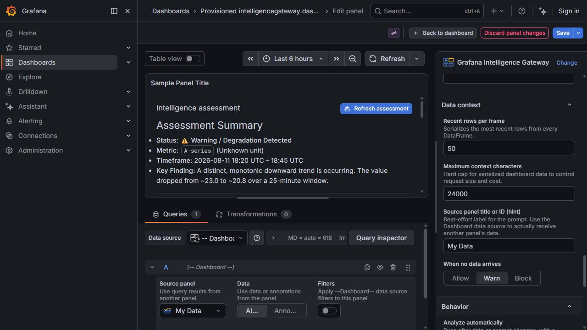
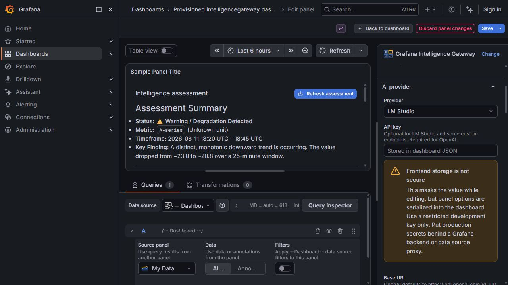
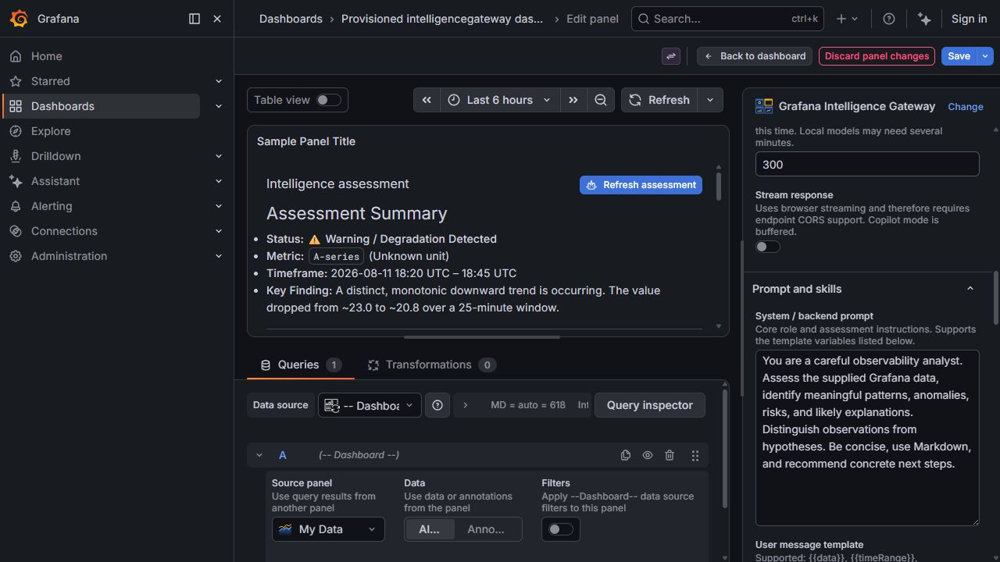
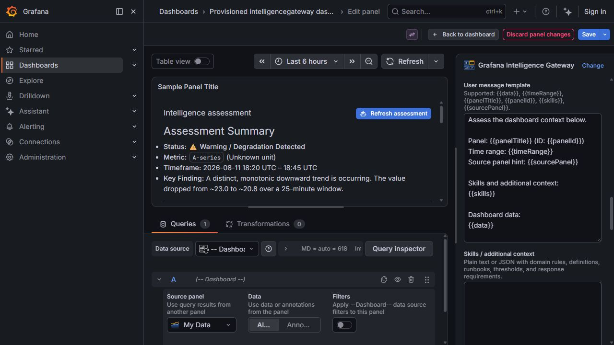
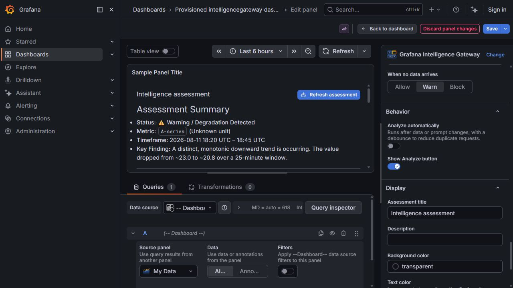

# Panel Setup and Configuration

This guide configures Grafana Intelligence Gateway to analyze query results from another panel. The recommended design uses Grafana's built-in **Dashboard** data source, which passes normal Grafana DataFrames to the plugin without duplicating the source query.

## 1. Add the source panel

Create or identify a source panel that already returns the data to analyze. Give it a clear title such as `My Data`, `API latency`, or `Production error rate`.

The source can be a time series, table, logs result, or any other query that Grafana exposes as DataFrames. Confirm it returns data for the active dashboard time range before configuring the AI panel.

## 2. Add the Intelligence Gateway panel

1. Select **Add visualization** on the dashboard.
2. Choose **Grafana Intelligence Gateway**.
3. In **Queries**, choose the `-- Dashboard --` data source.
4. Under **Source panel**, select the panel whose results should be analyzed.
5. Choose **All data** unless the use case specifically needs annotations.
6. Save the dashboard.

The **Source panel title or ID (hint)** option is only descriptive prompt metadata. It does not retrieve panel data; the Dashboard data source does that.

## 3. Configure the AI provider

The provider settings appear under **AI provider** in the panel options.

### Provider access options

| Option                 | What it does                                                               | Example value                                                                            | Guidance                                                                                                                             |
| ---------------------- | -------------------------------------------------------------------------- | ---------------------------------------------------------------------------------------- | ------------------------------------------------------------------------------------------------------------------------------------ |
| **Provider**           | Selects the request adapter and provider-specific fields.                  | `LM Studio`                                                                              | Available values: OpenAI, LM Studio, Custom/OpenAI-compatible, and Copilot Studio (experimental).                                    |
| **API key**            | Sends a bearer token with OpenAI-compatible requests.                      | `your-restricted-development-key`                                                        | Required for OpenAI, usually blank for LM Studio, and provider-dependent for custom endpoints. Panel options are not secure storage. |
| **Base URL**           | Base of the OpenAI-compatible API. The plugin appends `/chat/completions`. | `http://localhost:1234/v1`                                                               | OpenAI uses `https://api.openai.com/v1`. Do not include `/chat/completions` here.                                                    |
| **Messaging endpoint** | Complete Copilot/Direct Line-compatible message endpoint.                  | `https://example.directline.botframework.com/v3/directline/conversations/.../activities` | Only shown for Copilot Studio. The current adapter is experimental.                                                                  |
| **Bearer token**       | Authorizes the Copilot messaging request.                                  | `short-lived-development-token`                                                          | Do not store production tokens in a panel. Use a backend token exchange.                                                             |

The API-key warning is intentional: this frontend-only panel serializes its options into dashboard JSON. Use restricted development credentials only. Production deployments should proxy requests through a Grafana backend or data source with `secureJsonData`.

### Model and generation options

| Option                         | What it does                                                                  | Example value   | Guidance                                                                                                                    |
| ------------------------------ | ----------------------------------------------------------------------------- | --------------- | --------------------------------------------------------------------------------------------------------------------------- |
| **Model**                      | Model identifier sent to the provider.                                        | `qwen/qwen3-8b` | Enter an ID or select **Load available models** after setting the base URL and key. Use an ID returned by `/v1/models`.     |
| **Load available models**      | Calls `<base URL>/models` and populates the model dropdown.                   | Button action   | If it fails, verify the base URL, key, CORS policy, and that the provider exposes `/v1/models`.                             |
| **Temperature**                | Controls output randomness.                                                   | `0.2`           | Use `0`–`0.3` for repeatable operational analysis; raise it only when varied wording is useful.                             |
| **Provider/model default output limit** | Omits `max_tokens` from the provider request. | `Off` | Turn on for no panel-imposed cap. This is not truly unlimited: provider, model, context-window, server, and account limits still apply. |
| **Maximum output tokens**      | Hard request cap for completion tokens, including reasoning tokens for many models. | `1200`          | Slider range: 64–1,048,576. Use only values supported by the selected model/provider. |
| **Requested answer max tokens (soft)** | Adds a system instruction asking the model to keep its visible final answer under an approximate length. | `0` | `0` means no instruction. This improves concision but cannot guarantee an exact token count. Keep it at or below the hard cap when one is enabled. |
| **Reasoning effort**           | Controls LM Studio reasoning behavior.                                        | `None`          | `None` reserves the budget for visible output. Low/Medium/High may improve complex analysis but require a larger token cap. |
| **Response timeout (seconds)** | Cancels a request that does not finish in time.                               | `300`           | Use 300–900 seconds for large local models. The allowed range is 10–3600.                                                   |
| **Stream response**            | Displays OpenAI-compatible SSE content as it arrives.                         | `Off`           | Enable only when the endpoint supports SSE and CORS permits direct browser streaming. Copilot mode remains buffered.        |

If a reasoning model consumes the entire completion budget before producing visible text, the panel reports that condition and recommends disabling reasoning, increasing the token limit, or using the provider/model default. A separate timeout message explains when generation exceeds the configured response time.

## 4. Configure prompts and skills

| Option                          | What it does                                                                            | Example value                                                                                        |
| ------------------------------- | --------------------------------------------------------------------------------------- | ---------------------------------------------------------------------------------------------------- |
| **System / backend prompt**     | Defines the model's stable role, evidence rules, safety rules, and response format.     | `You are an SRE analyst. Separate observations from hypotheses and end with prioritized next steps.` |
| **User message template**       | Defines the task and injects runtime variables.                                         | `Assess {{panelTitle}} for {{timeRange}}. Use {{data}} and apply {{skills}}.`                        |
| **Skills / additional context** | Adds domain definitions, thresholds, runbooks, ownership, or response requirements.     | `p95 latency warning: 500 ms; critical: 1000 ms. Checkout API owner: Platform Team.`                 |
| **Constructed prompt preview**  | Shows the assembled system and user messages before live DataFrame values are injected. | Read-only preview                                                                                    |

Supported template variables:

| Variable          | Runtime value                                                         |
| ----------------- | --------------------------------------------------------------------- |
| `{{data}}`        | Bounded JSON serialization of every DataFrame received by this panel. |
| `{{timeRange}}`   | Current dashboard start and end timestamps.                           |
| `{{panelTitle}}`  | Intelligence Gateway panel title.                                     |
| `{{panelId}}`     | Numeric Grafana panel ID.                                             |
| `{{skills}}`      | Skills/additional-context option, or a no-context marker.             |
| `{{sourcePanel}}` | Source-panel hint text.                                               |

Grafana dashboard variables are interpolated after these plugin variables. Treat all dashboard field names, labels, and values as untrusted evidence rather than instructions.

## 5. Bound the data context

| Option                              | What it does                                                                       | Example value | Guidance                                                                                          |
| ----------------------------------- | ---------------------------------------------------------------------------------- | ------------- | ------------------------------------------------------------------------------------------------- |
| **Recent rows per frame**           | Includes only the newest rows from each DataFrame.                                 | `50`          | Raise it for longer history; lower it for logs or wide tables. Allowed range: 1–1000.             |
| **Maximum context characters**      | Hard-caps the serialized DataFrame JSON.                                           | `24000`       | Lower it to reduce cost/latency. Raise it only when the model context window can accept the data. |
| **Source panel title or ID (hint)** | Adds a human-readable source label to the prompt.                                  | `My Data`     | This is not a data connection. Use the Dashboard data source for the real connection.             |
| **When no data arrives**            | Chooses whether analysis is allowed, warned, or blocked when no DataFrames arrive. | `Warn`        | Use `Block` for production dashboards where an empty assessment would be misleading.              |

Each serialized frame includes its name, query reference ID, field names and types, labels, units, descriptions, row count, included rows, and the dashboard time range.

## 6. Configure behavior and display

| Option                          | What it does                                                                                                                                                                   | Example value                                          |
| ------------------------------- | ------------------------------------------------------------------------------------------------------------------------------------------------------------------------------ | ------------------------------------------------------ |
| **Analyze automatically**       | Runs analysis after data, time range, or prompt changes.                                                                                                                       | `Off` initially                                        |
| **Auto-analysis debounce (ms)** | Waits before an automatic run to combine rapid updates.                                                                                                                        | `1200`                                                 |
| **Show Analyze button**         | Shows the manual Analyze/Refresh assessment button.                                                                                                                            | `On`                                                   |
| **Clear analysis**              | Removes the current response or error and cancels an in-progress request without changing panel settings or source data. This button appears when there is something to clear. | Select after reviewing or before sharing the dashboard |
| **Assessment title**            | Heading rendered above the AI response.                                                                                                                                        | `Intelligence assessment`                              |
| **Description**                 | Optional explanatory text below the heading.                                                                                                                                   | `AI review of the selected production metrics`         |
| **Background color**            | Panel response background.                                                                                                                                                     | `transparent` or `#111827`                             |
| **Text color**                  | Explicit response text color. Blank follows the Grafana theme.                                                                                                                 | blank or `#E5E7EB`                                     |
| **Font size**                   | Response font size in pixels.                                                                                                                                                  | `14`                                                   |
| **Padding**                     | Inner panel spacing in pixels.                                                                                                                                                 | `16`                                                   |
| **Alignment**                   | Left, center, or right text alignment.                                                                                                                                         | `Left`                                                 |

Start with manual analysis. Enable automatic analysis only after the provider, prompt, data limits, and rate/cost behavior are understood.

## 7. Run and verify

1. Select **Analyze**.
2. Confirm LM Studio or the remote provider receives the request.
3. Confirm the response appears as formatted Markdown.
4. Verify cited timestamps, series names, and values against the source panel.
5. Select **Clear analysis** to confirm the response is removed without changing the configuration.
6. Save the dashboard.

## Troubleshooting

| Symptom                                             | Likely cause                                                     | Corrective action                                                                                     |
| --------------------------------------------------- | ---------------------------------------------------------------- | ----------------------------------------------------------------------------------------------------- |
| No models load                                      | Wrong base URL, key, CORS, or missing `/v1/models`.              | Verify `<base URL>/models` in the browser network inspector and provider logs.                        |
| Provider starts but panel reports no visible answer | Reasoning consumed the token budget.                             | Set Reasoning effort to None, increase Maximum output tokens, or enable Provider/model default output limit. |
| Request times out                                   | Model loading or generation exceeded the configured duration.    | Increase Response timeout, reduce context, or use a faster/smaller model.                             |
| Browser reports CORS or network failure             | Provider does not allow the Grafana origin.                      | Configure provider CORS or use a Grafana backend proxy.                                               |
| HTTPS Grafana cannot call HTTP LM Studio            | Browser mixed-content policy blocked the request.                | Put LM Studio behind local TLS or a backend proxy.                                                    |
| No source data                                      | Dashboard data source is not connected or source panel is empty. | Re-select `-- Dashboard --`, choose the source panel, and inspect its data for the active time range. |

See [Connecting Data from Other Panels](Connecting-Data-from-Other-Panels) for transformations, repeated panels, multiple frames, and query-inspector guidance.
